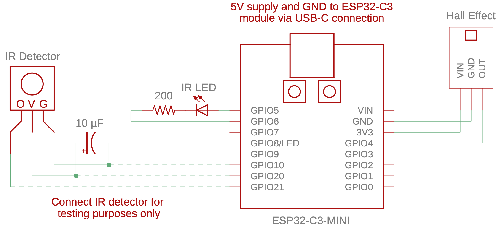

# C3-Beacon

Implements an IR beacon to emit bursts of a single character. The hardware is assumed to be an ESP32-C3 Super Mini module. Components are connected as shown below:

The Hall effect sensor serves to enable and disable transmission. When the sensor detects magnetic flux (i.e., a magnet is nearby), transmission is enabled. The carrier is generated on GPIO5 and is modulated by TX1 (UART1) on GPIO6. The default configuration uses a 38 kHz carrier frequency and broadcasts a single character `U` (`0x55` or `0b01010101`) every 100 ms. The built-in LED (GPIO8) blinks when transmission is enabled and is out when transmission is disabled.

The program also includes two options, both of which are enabled by default.

1. `INCREASE_POWER_USE` results in the WiFi module being turned on and periodically scanning for WiFi networks. During scanning, power consumption of the circuit increases from ~60 mA to ~120 mA. This may be necessary to prevent some rechargeable batteries from turning off due to insufficient power draw.

2. `SELF_TEST` outputs characters received from a connected IR receiver module to the standard UART. This may be used to validate the beacon.

### Build and Flash

Open the [Arduino IDE](https://www.arduino.cc/en/software) and configure it for the ESP32. Use a USB-C extension cable to connect your ESP32-C3 to your computer. Use the **Tools→Board→esp32** menu to select the **ESP32C3 Dev Module**. Serial output (for testing only) requires **Tools→USB CDC on Boot** to be enabled. The Port should be set as **COMx** on Windows or **dev.cu.usbmodel2101** (or similar) on Mac. The code provided with this lab requires version 3.0.0+ of the Arduino-ESP32 boards. Use the **Tools→Board→Boards Manager...** menu and find the **esp32 by Espressif** board package. Confirm that the version is **3.0.0** or greater. If necessary, use the dropdown menu to change versions. The code will not work in versions below 3.0.0 due to changes made to the underlying esp-idf API. Tested with version 3.1.1.

## Resources

* [ESP32-C3 Super Mini](https://www.sudo.is/docs/esphome/boards/esp32c3supermini/)
* [IR LED Data Sheet](https://www.we-online.com/components/products/datasheet/15400594A3590.pdf)
* [SS49E Hall Effect Sensor Data Sheet](https://prod-edam.honeywell.com/content/dam/honeywell-edam/sps/siot/en-us/products/sensors/magnetic-sensors/linear-and-angle-sensor-ics/common/documents/sps-siot-ss39et-ss49e-ss59et-product-sheet-005850-3-en-ciid-50359.pdf)
* [TSOP32238 IR Receiver Data Sheet](https://www.vishay.com/docs/82489/tsop322.pdf)
